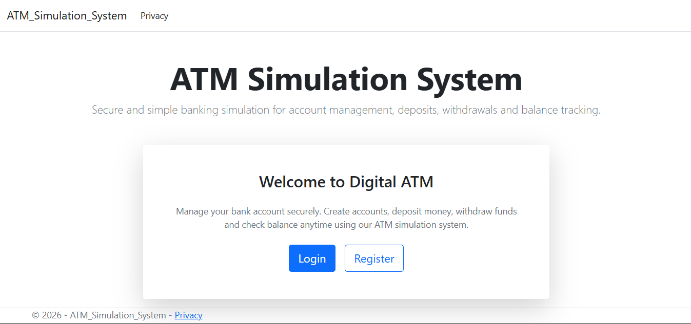
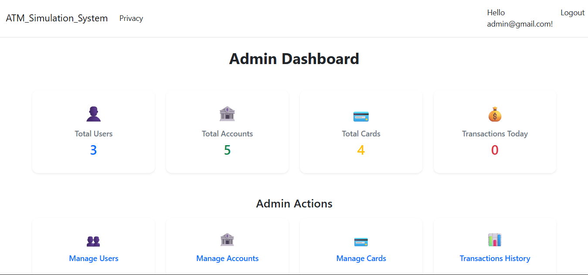
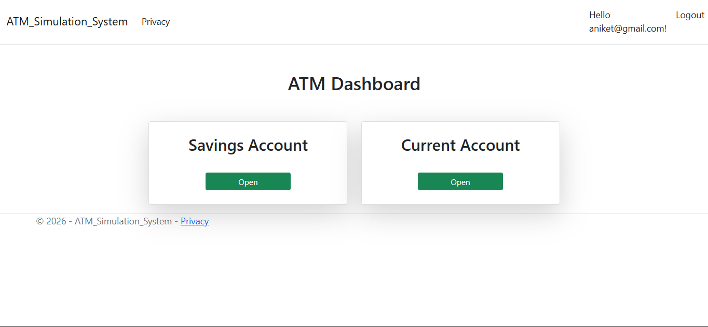
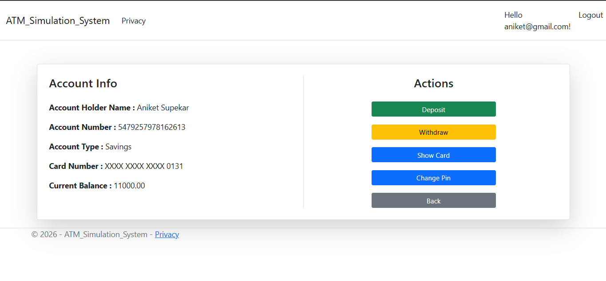
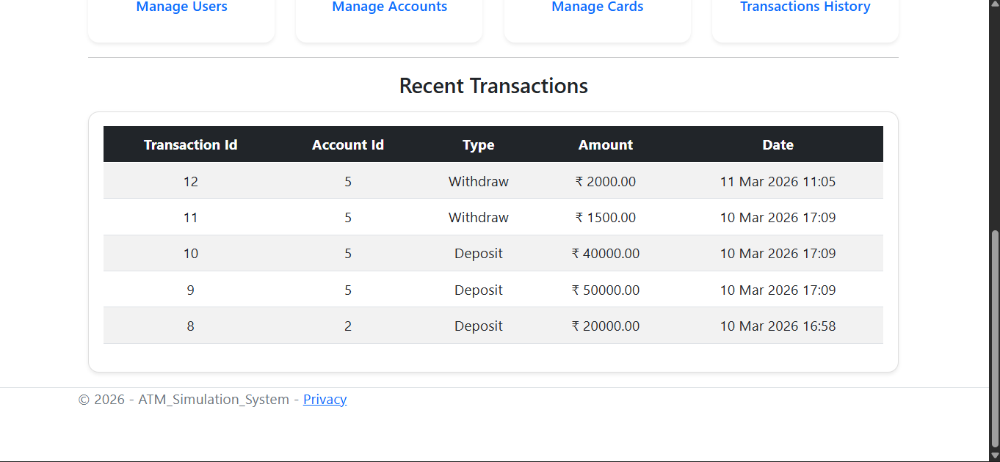
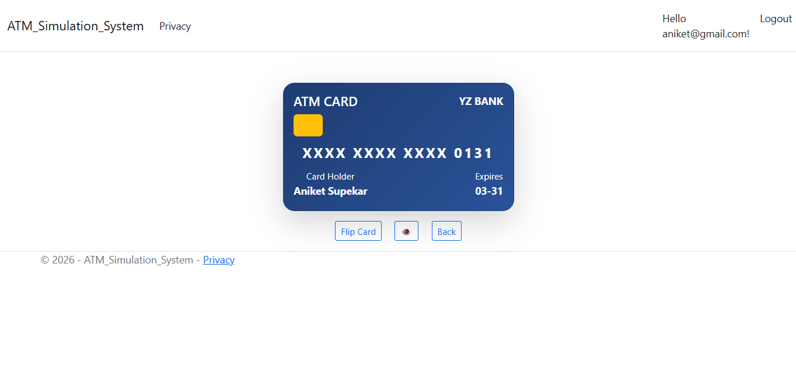

# ATM Simulation System (ASP.NET Core)

## Overview
ATM Simulation System is a full-stack web application that replicates core banking operations such as balance enquiry, deposit, withdrawal, and transaction tracking. It demonstrates secure user authentication, transaction handling, and real-world financial system behavior.

## Features
- Secure user login and authentication  
- Balance enquiry functionality  
- Deposit and withdrawal operations  
- PIN change functionality  
- Transaction history with filtering  
- Account lockout after multiple failed login attempts  
- Admin panel for account management  

## Tech Stack
- ASP.NET Core MVC  
- Entity Framework Core  
- SQL Server  
- C#  
- Bootstrap  
- HTML, CSS, JavaScript  

## Screenshots

### Home Page

### Admin Dashboard

### User Dashboard

### Account Info

### Recent Transaction

### Show Card

## How to Run

1. Clone the repository  
   git clone https://github.com/supekar-aniket/ATM-Simulation-System.git

2. Open the project in Visual Studio  

3. Update the connection string in appsettings.json  

4. Apply migrations (if required)  
   update-database

5. Run the application  

## Key Concepts Used
- MVC Architecture  
- Authentication & Authorization
- CRUD Operations  
- Transaction Handling  
- Database Design & Normalization  

## Future Improvements
- Add transaction alerts/notifications  
- Implement fund transfer between accounts  
- Enhance UI with better visualization  
- Add API support for mobile integration  

## Author
Aniket Supekar  
GitHub: https://github.com/supekar-aniket